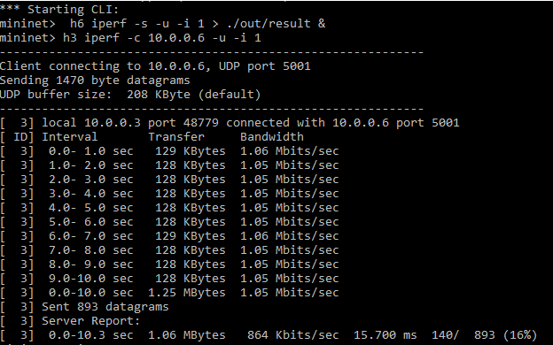
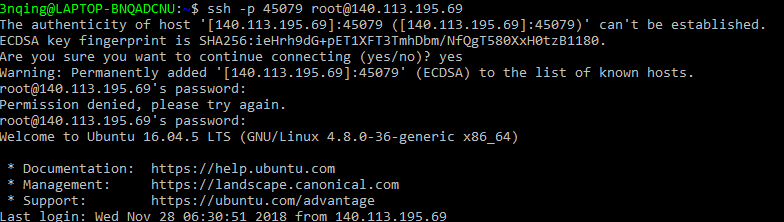

# Network Topology with Mininet

This repository is lab for NCTU course "Introduction to Computer Networks 2018".

---
## Abstract

In this lab, we are going to write a Python program which can generate a network topology using Mininet and use iPerf to measure the bandwidth of the topology.

---
## Objectives

1. Learn how to create a network topology with Mininet
2. Learn how to measure the bandwidth in your network topology with iPerf

---
## Execution


* **Describe how to execute your program**
  (This guide assumes you already have the relevant applications and dependencies available in the provided container downloaded)

  1. Pull the code into a folder "Network_Topology"
        ```console
        $ git clone https://github.com/nctucn/lab2-SamsonChoo.git Network_Topology
        ```
  2. Change directory to Network_Topology/src
        ```console
        $ cd src/
        ```
  3. Run topology.py and wait for the mininet CLI
        ```console
        $ ./topology.py
        ```
  4. In the CLI terminal, use *iperf* to measure the performance of the network
        ```console
        mininet> h6 iperf -s -u -i 1 > ./out/result &
        mininet> h3 iperf -c 10.0.0.6 -u –i 1 
        ```
  5. Exit the mininet CLI
        ```console
        mininet> quit 
        ```
  6. Review and evaluate the results stored in out/result
        ```console
        $ more out/result
        ```
  
  
* **Show the screenshot of using iPerf command in Mininet**


---
## Description

### Mininet API in Python
We will use Mininet to emulate a complete network of hosts, links, and switches on a single machine. It creates virtual networks using process-based virtualization and network namespaces - features that are available in recent Linux kernels. I shall explain my implementation of the API below.
* **Importing Libraries**

    * *from mininet.cli import CLI*
    Simple command-line interface to talk to nodes.
    
    * *from mininet.net import Mininet*
    Network emulation with hosts spawned in network namespaces
    * *from mininet.topo import Topo*
    Data center network representation for structured multi-trees.
    * *from mininet.node import OVSController*
    Open vSwitch controller.
    * *from mininet.link import TCLink*
    Link with symmetric TC interfaces configured via opts.
    * *from mininet.util import dumpNodeConnections*
    Dump connections to/from nodes.
    * *from mininet.log import setLogLevel*
    Setup loglevel. Convenience function to support lowercase names.
* **Creating network and adding elements**
I will be using the mid-level API: The mid-level API adds the Mininet object which serves as a container for nodes and links. It provides a number of methods (such as addHost(), addSwitch(), and addLink()) for adding nodes and links to a network, as well as network configuration, startup and shutdown (notably start() and stop().) It is the simplest and most concise compared low-level and high-level, because it doesn't require creation of a topology class.
    * ```net = Mininet(controller = OVSController,link=TCLink)``` to create mininet with OVSController and utilises TCLink
    * ```h1 = net.addHost('h1')``` to add host
    * ```s1 = net.addSwitch('s1')``` to add switch
    * ```c0 = net.addController('c0')``` to add controller
    * ```net.addLink(node1,node2,bw=40,delay='52us',loss=2)``` to create link between node1 and node2 with bw(bandwidth) given in Mbits, delay given in string, and loss given in percentage 

* **Execution**
    * ```net.start()``` to start the mininet
    * ```net.pingAll()``` to test connections between all nodes
    * ```dumpNodeConnections()``` to dump connection information
    * ```CLI(net)``` to call the CLI in the end

### iPerf Commands
What is iPerf / iPerf3 ?
iPerf3 is a tool for active measurements of the maximum achievable bandwidth on IP networks. It supports tuning of various parameters related to timing, buffers and protocols (TCP, UDP, SCTP with IPv4 and IPv6). For each test it reports the bandwidth, loss, and other parameters. We will use it to test our network.

```console 
h6 iperf -s -u -i 1 > ./out/result &
h3 iperf -c 10.0.0.6 -u –i 1
```
iPerf parameters:
&nbsp;&nbsp;&nbsp;&nbsp;&nbsp;&nbsp;*-s*: &nbsp; Run iPerf in server mode
&nbsp;&nbsp;&nbsp;&nbsp;&nbsp;&nbsp;*-u*: &nbsp; Use UDP rather than TCP
&nbsp;&nbsp;&nbsp;&nbsp;&nbsp;&nbsp;*-i*: &nbsp; Sets the interval time in seconds between periodic bandwidth, jitter, and loss reports
&nbsp;&nbsp;&nbsp;&nbsp;&nbsp;&nbsp;*-c*: &nbsp; Run iPerf in client mode, connecting to an iPerf server running on host.

Putting them together, the command above means to run iPerf with h6 as server and h3 as client, with UDP protocol, and then to measure and report the various statistics at a 1 second interval. The result from the server is parsed into a file named "result" and placed in the src/out folder.
### Tasks

1. **Environment Setup**
    * Join lab at https://classroom.github.com/a/K8gaizQG
    * Login to container with password "cn2018" (Ubuntu used)
    ```console
    $ ssh -p 45079 root@140.113.195.69
    ```
    * Clone github repository to “Network_Topology”
    ```console
     $ git clone https://github.com/nctucn/lab2-SamsonChoo.git Network_Topology
    ```
    * Run ```mn``` to test run mininet
    * If " Error connecting to ovs-db with ovs-vsctl" occurs, run ```service openvswitch-switch start``` to start the service of Open vSwitch before testing again
    
    
    


2. **Example of Mininet**
    * Run example code (chmod +x makes the file executable)
    ```console
    $ chmod +x example.py
    $ ./example.py 
    ```
    


3. **Topology Generator**
    * Divide student ID by 3 ==> 745079 % 3 = 2
    * Topology 2
    
    * Refer to [Mininet API in Python](#mininet-api-in-python) for implementation of code

4. **Measurement**
    * Run ```./topology.py``` to execute code and wait for the CLI prompt
    * Refer to [iPerf Commands](#iperf-commands) for explanation and implementation of iPerf command to be keyed in
    * Total rate of packet loss should be between 13%~18%
    * Run ```mn -c``` to clear mininet data and repeat step 4 for a couple of times to ensure that the value is consistent
    
    
    

---
## References
* **Mininet**
    * [Introduction to Mininet](https://github.com/mininet/mininet/wiki/Introduction-to-Mininet)
    * [Mininet Python API Reference Manual](http://mininet.org/api/annotated.html)

* **iPerf**
    * [iPerf documentation](https://iperf.fr/iperf-doc.php)

* **Vim**
    * [Vim Cheat Sheet](https://www.maketecheasier.com/vim-keyboard-shortcuts-cheatsheet/)

* **Others**
    * [Markdown Syntax Reference](https://github.com/adam-p/markdown-here/wiki/Markdown-Cheatsheet#images)


---
## Contributors


* [Samson Choo](https://github.com/SamsonChoo)
* [David Lu](https://github.com/yungshenglu)

---
## License

GNU GENERAL PUBLIC LICENSE Version 3
